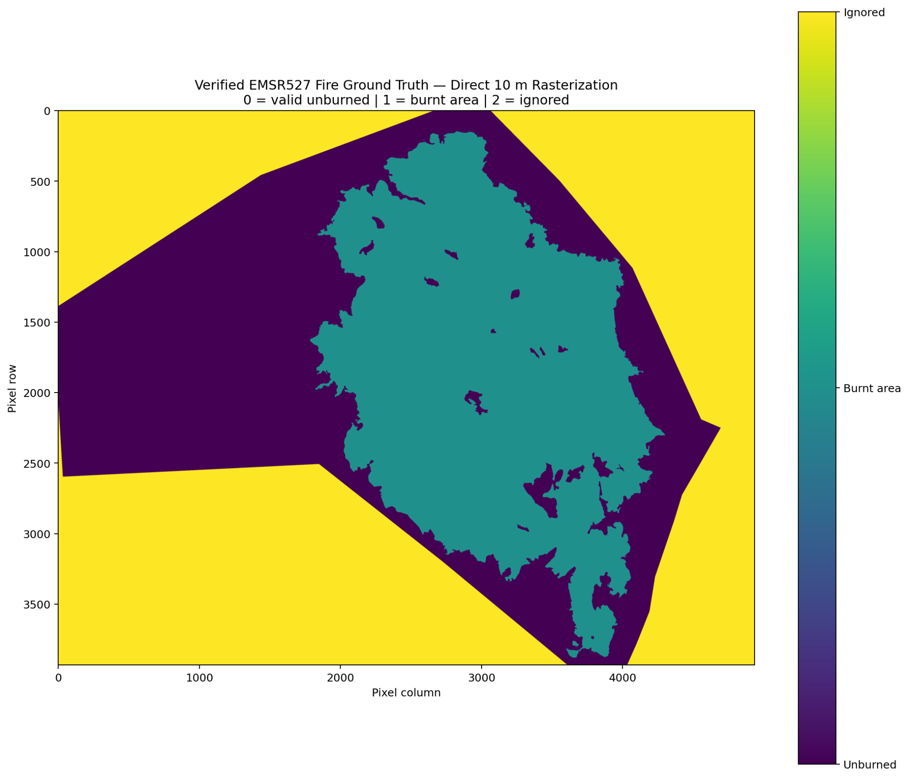
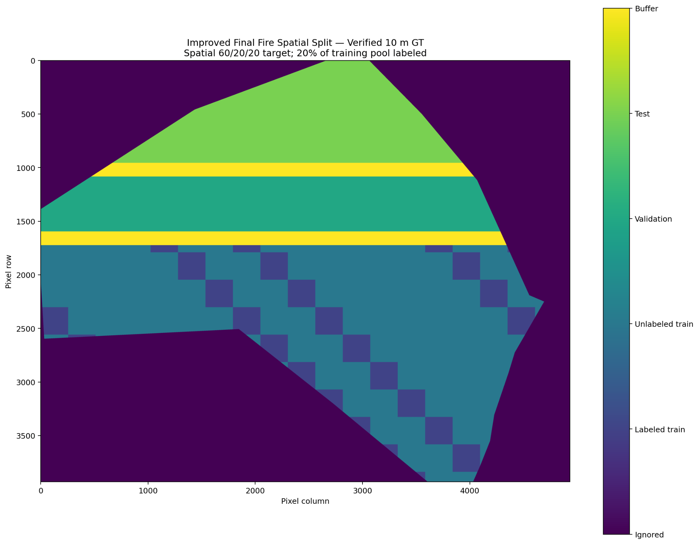
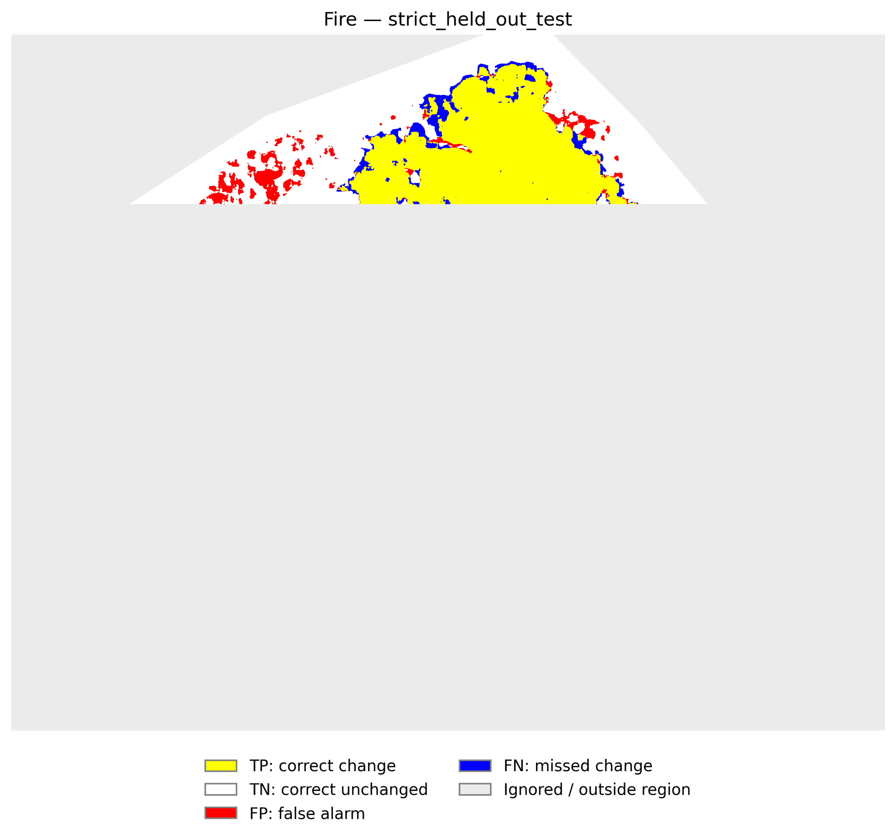
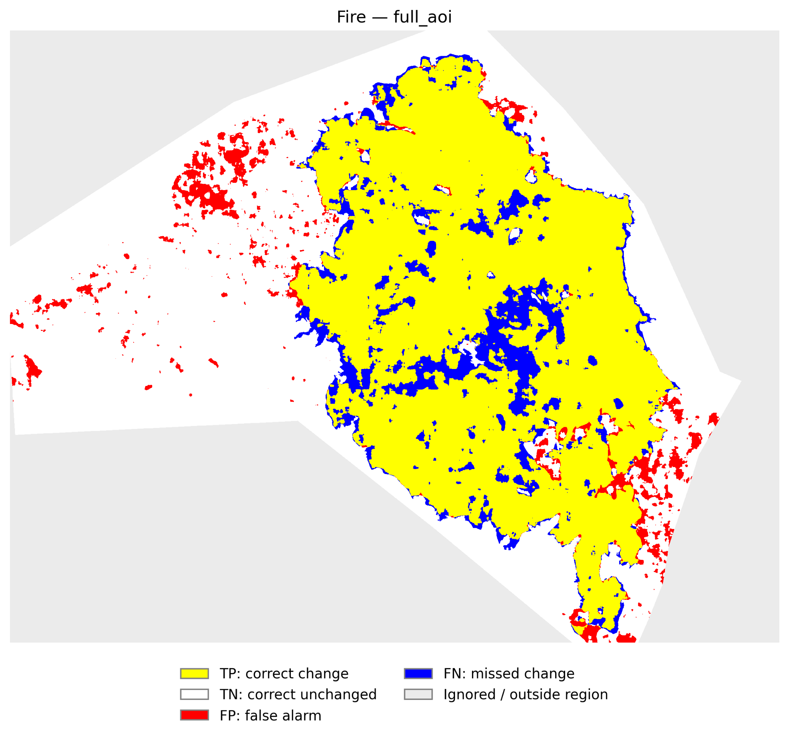

# Sentinel-1 SAR change detection

Example code accompanying **Mapping Floods and Burned Areas Using Sentinel-1: Development of a Unified Framework for Comparing Convolutional Neural Network Architectures and Learning Strategies**.

Greek thesis title: «Χαρτογράφηση πλημμυρών και καμένων εκτάσεων με Sentinel-1: Ανάπτυξη ενιαίου πλαισίου για τη σύγκριση αρχιτεκτονικών και στρατηγικών μάθησης συνελικτικών νευρωνικών δικτύων».

This repository provides generalized, reusable versions of the actual research code developed and used for the **flood and burned-area experiments** in the thesis. It presents the common framework for comparing convolutional architectures, learning strategies and temporal inputs, with configurable paths and consistent interfaces for use with other datasets.

The package contains **18 pipeline scripts**, two shared helpers and optional software tests. It is a representative public implementation of the research workflow, rather than a complete archive of every case-specific script or historical experiment. The original observations, numerical ground-truth datasets and trained weights are not distributed. Selected PNG figures from the fire experiment are included at the end of this README to illustrate the workflow and its outputs.

The research experiments and the checks of this public package have different scopes: the thesis reports experiments on real flood and fire data; this generalized release has been checked end to end on small synthetic CPU inputs. Details are recorded in [VERIFICATION.md](VERIFICATION.md).

## Repository layout

The entry points are grouped by workflow. Keep the shared helpers at the repository root and retain the folder names below.

| Folder or root files | Purpose |
|---|---|
| `ground_truth_and_spatial_split/` | Ground-truth rasterization and buffered spatial split |
| `supervised_bitemporal/` | Supervised bitemporal training, inference and evaluation |
| `supervised_multitemporal/` | Supervised multitemporal training, inference and evaluation |
| `semisupervised_bitemporal/` | Bitemporal Mean Teacher training, inference and evaluation |
| `semisupervised_multitemporal/` | Multitemporal Mean Teacher training, inference and evaluation |
| `unsupervised/` | AE training, baseline construction, inference and evaluation |
| `tests/` | Synthetic pipeline and integrity checks |
| `docs/images/` | Illustrative thesis PNGs |
| `pipeline_config.py`, `pipeline_checks.py` | Shared configuration and consistency helpers |
| Root Markdown, JSON and requirements files | Documentation, example configuration and dependencies |

Run the documented commands from the repository root. Entry points locate the shared helpers relative to their own files. An explicitly supplied relative `--config` path is relative to the current working directory; paths inside the JSON are relative to that JSON file.

## Setup

Use Python 3.10 or newer (tested with Python 3.12 on Linux CPU). Create a virtual environment, activate it and install the dependencies:

```bash
python -m venv .venv
# Linux/macOS:
source .venv/bin/activate
# Windows PowerShell instead: .venv\Scripts\Activate.ps1
python -m pip install -r requirements.txt
```

The scripts automatically use CUDA when available. For a CUDA build, install PyTorch appropriate to your CUDA environment before the remaining requirements. The included checks used CPU only; GPU behavior and large-scene memory consumption were not validated. Checkpoints are loaded with `weights_only=False`: use only checkpoints you generated or otherwise trust.

## Input contract

Copy `config.example.json` to `config.json` and set the paths. Every relative path resolves next to the JSON file, regardless of the shell's working directory.

| Input | Required content |
|---|---|
| `data.before_dir` | Only pre-event `.mat` acquisitions; at least two for the complete five-method workflow. Every file in this directory is used by multitemporal and AE stages. |
| `data.after` | One explicit post-event `.mat`, outside the BEFORE directory. |
| `data.bitemporal_before` | One acquisition inside BEFORE, fixed for both bitemporal methods. |
| Each image MAT | SciPy-readable MATLAB file (not HDF5/v7.3); default key `croppedImg`, finite numeric array `(H, W, 2)`, channels **VH, VV**. `data.image_key` changes this key. |
| `ground_truth.reference_tif` | Georeferenced two-band TIFF with a CRS, the same acquisition and crop as `reference_mat`. TIFF band order is checked in both possible orders against the MAT. |
| `ground_truth.reference_mat` | Matching MAT used to check reference dimensions and per-channel correlation. |
| `ground_truth.aoi_vector` | Polygon or MultiPolygon layer with a CRS defining the area of interest. |
| `ground_truth.event_vector` | Polygon layer with a CRS and the configured label field. `positive_labels` denotes changed areas; `ignore_labels` excludes uncertain areas. Matching strips whitespace and ignores case. |

All acquisitions must have the same dimensions, pixel alignment, crop, orientation, polarization order and consistent SAR value representation. Perform the geospatial preparation below before running the Python pipeline. The scripts do not perform terrain correction, resample acquisitions or convert between linear values and dB. A MAT contains no georeferencing; equal dimensions and reference correlation do not prove co-registration of the other dates.

The reference check tests both TIFF band orders using full arrays and requires a mean channel correlation of at least 0.85 and an individual channel correlation of at least 0.75 by default. Nonfinite MAT values are rejected. Keep a georeferenced reference TIFF for the exact crop represented by its matching MAT, including the correct crop transform.

## Data preprocessing: from Sentinel-1 products to model inputs

The procedure below follows **Chapter 3, Sections 3.1 and 3.4-3.6 of the thesis**, particularly Table 3.4 and Figure 3.7. The same Sentinel-1 preprocessing workflow was used for both the flood and fire experiments. The SNAP and MATLAB stages are performed before the Python scripts in this repository.

### 1. Select and organize the acquisitions

Obtain Sentinel-1 **IW acquisitions with both VH and VV polarizations** from Copernicus Browser. Figure 3.7 identifies the input products as Sentinel-1 GRD. Select genuinely pre-event observations and one suitable post-event observation covering the same area. Keep the AFTER acquisition fixed when comparing bitemporal and multitemporal methods on a given event; use the same selected BEFORE for both bitemporal methods.

The thesis used 13 BEFORE acquisitions and one fixed AFTER per case study. This public package accepts a configurable number of BEFORE acquisitions, with at least two required for the complete workflow. Keep only the intended BEFORE MAT files in `data.before_dir` and store the AFTER file separately.

### 2. Import and inspect the products in ESA SNAP

Open each Sentinel-1 product in SNAP and inspect the available amplitude bands to confirm that the product and both polarizations loaded correctly. As described in the thesis, this visual inspection is a content check, not an additional transformation of the pixel values.

### 3. Apply Range-Doppler Terrain Correction

For each acquisition, open **Radar → Geometric → Terrain Correction → Range-Doppler Terrain Correction** and use a consistent target grid across the time series.

| Setting | Configuration documented in the thesis |
|---|---|
| Geometric correction | Range-Doppler Terrain Correction |
| Map projection | WGS 84 / UTM zone 34N, **EPSG:32634**, for the thesis study areas |
| Final grid spacing | **10 m** in the final datasets |
| Mask out areas without elevation | **Disabled** |
| Retained polarizations | **VH and VV** |
| Export format | **GeoTIFF-BigTIFF** |

For another geographic region, choose a suitable projected CRS and use it consistently for every acquisition, reference raster and vector layer. The final acquisitions must agree in pixel size, grid origin, spatial extent and orientation; matching the CRS alone is insufficient.

The thesis does not provide a complete SNAP processing graph or explicit DEM/resampling-kernel settings. Those details should be recorded for a new dataset; they cannot be reconstructed exactly from the text. Additional calibration, orbit, noise-removal or speckle-filtering steps are not specified in the cited workflow and are therefore not presented here as steps performed in the thesis.

### 4. Apply the same spatial crop in MATLAB

Import the terrain-corrected GeoTIFF-BigTIFF files into MATLAB and crop the study area using the **same geographic geometry for every acquisition**. Apply identical row/column bounds only after confirming that the rasters share the same grid. Keep a georeferenced TIFF of the cropped reference with its updated spatial transform; cropping a matrix without updating its georeferencing is insufficient for ground-truth rasterization.

Store each cropped acquisition as a `single` array named `croppedImg`, with shape **H × W × 2** and channel order **VH, VV**. Once the two cropped band matrices have been correctly identified and aligned, the export convention is:

```matlab
% croppedVH and croppedVV are the aligned, cropped polarization bands.
croppedImg = cat(3, single(croppedVH), single(croppedVV));
save('before_selected.mat', 'croppedImg', '-v7');
```

Repeat for every BEFORE and the fixed AFTER acquisition, using distinct filenames. The explicit `-v7` option above is a compatibility choice for this repository's SciPy MAT reader; the thesis specifies the variable name, type and shape, not the MAT serialization version. HDF5/v7.3 MAT files are not supported by these loaders. Check the MAT size limit when exporting very large crops.

Do not normalize each image using its whole-scene statistics during export. Preserve consistent SAR values in the MAT files and let the training scripts fit normalization on the training region. The loaders transpose `(H, W, 2)` to `(2, H, W)` internally.

### 5. Prepare the ground-truth reference

Use an independent, authoritative reference product, such as the **Copernicus Emergency Management Service vector products** used in the thesis. Read the product's class definitions and select **definite changed/damaged pixels** as the positive class: the labels must indicate a confirmed occurrence of the target phenomenon, rather than a possible or ambiguous change. Interpret “damaged” according to the chosen task and reference-product semantics; do not combine categories merely because their names sound similar.

Define a binary reference and a separate validity mask:

| Pixel status | Representation |
|---|---|
| Confirmed target change/damage within valid reference coverage | `ground_truth = 1`, `valid_mask = 1` |
| Valid, mapped background outside the selected definite-change class | `ground_truth = 0`, `valid_mask = 1` |
| Outside mapped coverage, invalid SAR pixels or unresolved reference labels | `valid_mask = 0`; excluded from losses and metrics |

Use the **official mapped AOI**, rather than treating the absence of polygons outside that coverage as confirmed background. Reproject vectors to the reference raster's CRS, repair invalid geometries and rasterize directly on the same cropped grid as the SAR inputs. The thesis uses **`ALL_TOUCHED=False`**, so polygon membership is based on pixel centres.

Set `ground_truth.label_field` and `ground_truth.positive_labels` to the actual field and labels of your product. Supply the AOI polygons through `ground_truth.aoi_vector` and the event polygons through `ground_truth.event_vector`. If multiple source layers cover the study area, prepare a combined event layer with a consistent label field and an AOI layer containing the intended coverage. Separate input/reference preparation from model predictions; predictions must not be used to define ground truth.

The generic helper assigns zero to all remaining valid pixels, including unlisted event labels. Use `ground_truth.ignore_labels` for labels that cannot be treated as confirmed background. Resolve contradictory or overlapping classes according to the reference product before rasterization; in this helper, configured ignore polygons exclude overlapping pixels. This generic rule must be taken into account when preparing a reference layer with its own class-priority rules.

Run `create_ground_truth.py`, then inspect the preview, validity mask and verification report. Confirm that boundaries align with the SAR reference and that positive, negative and excluded areas have the intended meaning. The MAT stores binary labels plus masks; the exported ground-truth TIFF uses **0 = unchanged, 1 = changed, 255 = ignored**.

### 6. Freeze the spatial split, then normalize during training

Create and inspect the buffered spatial split with `create_spatial_split.py` before fitting any model. Reuse that split across all five methods for the same study area. Check that SAR arrays, ground truth and split masks have identical dimensions and correspondence pixel by pixel.

As described in Section 3.4.4, normalization is performed in the **training code**, not in SNAP: compute the 1st and 99th percentiles for each acquisition/channel from `train_pool` pixels, clip to that range and standardize using the clipped training values' mean and standard deviation. Save those statistics and reuse them for the corresponding inference inputs. Validation/test pixels must not contribute to fitting these statistics. The AE AFTER-specific normalization and baseline rules are detailed below.

## Shared experimental protocol

The split is constructed once and reused across methods. It searches geographic orientations and buffered boundaries using class-balance constraints: this is **label-informed split construction**, frozen before model fitting or model selection. It is not optimization against test predictions. Default 60/20/20 targets refer to usable valid pixels **after removing buffers**, with a 2.5 percentage-point tolerance per region. The labeled subset targets 20% of the train pool (blockwise, within configured tolerances); the rest is unlabeled. Default minimum minority-class fraction is 20%, and prevalence deviation from the overall valid region is at most 10 percentage points. These constraints can be infeasible, especially for rare changes. Inspect the diagnostics and design any alternative split protocol before training; the code does not silently relax them.

Training candidate patches lie entirely within `train_pool`. Supervised losses use only `labeled_train`. Mean Teacher uses those same labeled pixels plus confidence-filtered consistency on `unlabeled_train`; teacher and student receive the same temporal pair and geometry, with Gaussian noise added to the student. AE trains on BEFORE acquisitions in the train pool without class-label losses. Ignored and held-out pixels are excluded from all training losses.

| Method | Input and prediction |
|---|---|
| Unsupervised AE | Two-channel BEFORE patches; post-event reconstruction error compared with global and pixelwise pre-event baselines. |
| Supervised bitemporal | Four channels: VH/VV from the selected BEFORE, then VH/VV AFTER; masked BCE plus Dice loss. |
| Supervised multitemporal | One randomly selected BEFORE per patch, fixed AFTER, four channels; inference averages probabilities equally across BEFORE acquisitions. |
| Semisupervised bitemporal | Four-channel fixed pair with Mean Teacher; inference uses the EMA teacher. |
| Semisupervised multitemporal | Random BEFORE per training patch, fixed AFTER; EMA-teacher inference averages probabilities equally over BEFOREs. |

Multitemporal here does **not** stack every date as input channels. Normalization is per acquisition/channel: clip at train-pool 1st/99th percentiles, then standardize using the clipped train-pool mean and standard deviation. Training statistics are saved and reused for the corresponding inputs. The AE AFTER image has its own normalization fitted only at train-pool locations. AE global error statistics use train-pool pixels; pixelwise baselines use pre-event observations at every inference location, including held-out locations, without held-out labels. This spatially transductive input protocol should be stated when reporting results.

Select epoch, Gaussian smoothing sigma and threshold by validation IoU only. Default search uses sigma 0/1/2 and 199 thresholds from 0.01 to 0.99. Strictly greater IoU updates the selection, retaining the first encountered tied choice. Each supervised/Mean Teacher evaluator writes its selected configuration before calculating held-out metrics in the same invocation. Existing selections are protected against accidental reselection. AE uses separate `validate` and `test` invocations with a frozen, hashed selection. Fix the search space before examining test results.

**AE score:** inference writes unsmoothed HIGH-direction probabilities; the ABS evaluator applies `max(p_high, 1 - p_high)` **before** smoothing and selects global/pixelwise baseline mode on validation. ABS originated as a post-hoc extension in the supplied research evaluation. The separated protocol in this generic package does not establish that the historical thesis decisions were preregistered or originally made without post-hoc inspection.

Full-AOI metrics and TP/TN/FP/FN maps use the same selected prediction. Full AOI includes valid training, validation, test and buffer pixels; it is descriptive and **not held-out generalization**. The full-AOI and strict-test maps exclude ignored pixels.

## Execution order

Run commands from this repository directory, using the same config and `run_name` throughout. Paths below are generic. First create and inspect preprocessing outputs:

```bash
python "ground_truth_and_spatial_split/create_ground_truth.py" --config config.json
python "ground_truth_and_spatial_split/create_spatial_split.py" --config config.json
```

Inspect `ground_truth_preview.png`, `ground_truth_report.json`, the split preview and `split_stats.txt`. Confirm the split has valid fully contained training patches for your patch size. Then run any or all methods:

```bash
python "supervised_bitemporal/train_supervised_bitemporal.py" --config config.json
python "supervised_bitemporal/infer_supervised_bitemporal.py" --config config.json
python "supervised_bitemporal/evaluate_supervised_bitemporal.py" --config config.json

python "supervised_multitemporal/train_supervised_multitemporal.py" --config config.json
python "supervised_multitemporal/infer_supervised_multitemporal.py" --config config.json
python "supervised_multitemporal/evaluate_supervised_multitemporal.py" --config config.json

python "semisupervised_bitemporal/train_semisupervised_bitemporal.py" --config config.json
python "semisupervised_bitemporal/infer_semisupervised_bitemporal.py" --config config.json
python "semisupervised_bitemporal/evaluate_semisupervised_bitemporal.py" --config config.json

python "semisupervised_multitemporal/train_semisupervised_multitemporal.py" --config config.json
python "semisupervised_multitemporal/infer_semisupervised_multitemporal.py" --config config.json
python "semisupervised_multitemporal/evaluate_semisupervised_multitemporal.py" --config config.json

python "unsupervised/train_unsupervised.py" --config config.json
python "unsupervised/build_unsupervised_baselines.py" --config config.json
python "unsupervised/infer_unsupervised.py" --config config.json
python "unsupervised/evaluate_unsupervised.py" --config config.json --stage validate
python "unsupervised/evaluate_unsupervised.py" --config config.json --stage test
```

AE baselines must precede AE inference and correspond to the same checkpoints, patch and stride. Inference processes every configured epoch; there is no automatic choice of a newest run. `epoch_start`/`epoch_end` restrict inference and selection, not training. If reducing `epochs` in the example, reduce `epoch_end` as well. The default training duration remains 50 epochs; smoke checks use one.

## Configuration and outputs

`parameters.shared` supplies cross-stage settings; a method group overrides them. A setting applies only to stages that declare it. Unknown names are rejected across all groups, while known settings irrelevant to the current stage are allowed. Supported names are listed in `PARAMETERS.md`. Use top-level/data fields for paths, epochs and image keys. `PATCH` must be divisible by four and fit the image; `STRIDE` must be from 1 to `PATCH`. Keep the splitter's `PATCH_SIZE` consistent with model `PATCH`. Mean Teacher labeled/unlabeled loaders must have equal complete-batch counts; each needs at least one complete batch. Adjust batch sizes to available RAM/VRAM.

Defaults are retained from the source algorithms: BASE 32, PATCH 256; AE 8,000 samples/epoch, supervised 8,000 labeled samples/epoch, Mean Teacher 2,000 labeled and 4,000 unlabeled samples/epoch. `NUM_WORKERS=0` is the portable default. For CPU checks, setting `OMP_NUM_THREADS=1`, `MKL_NUM_THREADS=1` and `MPLBACKEND=Agg` is useful.

| Location under `output_root` | Outputs |
|---|---|
| `ground_truth/` | `ground_truth.mat`, raster masks, preview and verification report. MAT keys include `ground_truth` (0/1), `valid_mask`, `ignore_mask`, `ground_truth_with_ignore` (-1/0/1), `aoi_mask`, `s1_valid_mask`. |
| `spatial_split/` | `spatial_split.mat` with `train_pool`, `labeled_train`, `unlabeled_train`, `validation`, `test`, `buffer_mask`, `valid_mask`; GeoTIFF, preview and statistics. |
| `<method>/checkpoints/<run_name>/` | Per-epoch weights, normalization/configuration, training logs, initial input manifest and completed-run provenance. |
| `unsupervised/baselines/<run_name>/` | Global and pixelwise baseline MATs for each epoch and baseline provenance. |
| `<method>/predictions/<run_name>/` | Full-scene probability MATs and prediction hashes. All probability maps use `prob`; AE additionally records baseline mode and epoch metadata. |
| `<method>/results/<run_name>/` | Validation search, selected configuration, held-out metrics, final prediction, full-AOI metrics and confusion maps. AE freeze: `frozen_abs_configuration.json`; test: `abs_final_metrics.json`. |

Training refuses to overwrite a run directory. Ground truth and split refuse nonempty output directories because they are shared by every method/run under that `output_root`. Choose a new output root for a new preprocessing experiment. Input, split, ground-truth, checkpoint, baseline and prediction checks detect important mismatches; they are consistency checks, not a security boundary against deliberate manifest edits. Keep complete run folders together. Paths in generated private run metadata may be absolute; numerical run outputs are excluded from this distribution. Only the explicitly selected illustrative PNGs in `docs/images/` are included.

For an interrupted run, use the same config and original run directory:

```bash
python "supervised_bitemporal/train_supervised_bitemporal.py" --config config.json --resume outputs/supervised_bitemporal/checkpoints/experiment_01/supervised_last.pt
```

Last-checkpoint names are `supervised_last.pt`, `mean_teacher_last.pt` and `ae_last.pt` for the corresponding methods. Resume validates original inputs/configuration and checkpoint ownership. It does not restore every RNG state and is not bit-for-bit equivalent to uninterrupted training. Completed-run provenance is written only when training finishes; inference of a partial run is rejected. Do not change data, total epochs or settings to resume. If a failure leaves partial preprocessing/results, preserve and inspect them before manually archiving that incomplete directory and retrying; never use test outcomes to guide a rerun or a new search.

## Adaptations and verification

The latest supplied five evaluators were used, including their full-AOI metrics/confusion maps and ABS-compatible AE evaluation. Older evaluator variants were not restored. CNN architectures, sampling, losses, EMA and numerical defaults remain based on the supplied scripts. Changes cover configurable paths/date counts, consistent run selection, diagnostics, provenance checks, overwrite/frozen-selection guards, GeoTIFF block profiles and runtime compatibility. Ground-truth generation is a larger rewrite: explicit vector labels/AOI, dynamic CRS and reference checks replace case-specific inputs. It needs visual checking on each real dataset and uses full-array memory.

See `VERIFICATION.md` for the checks actually performed and their limits. The illustrative figures below are historical thesis outputs, not results of the synthetic software checks. No numerical thesis scores are reproduced by those checks. Real-data end-to-end validation, realistic resource sizing and GPU execution remain necessary before using this package for reported scientific results. These scripts are command-line entry points, not a supported importable API. A license is not included; select the appropriate terms before public distribution.


## Illustrative outputs from the thesis

The following figures are selected examples from the **fire experiment**. They provide a visual explanation of how the reference labels, spatial partitions and prediction errors relate to one another. They are included for interpretation of the research workflow; the underlying SAR arrays, numerical reference masks and trained weights are not distributed. Although the research framework covers both flood and fire experiments, the four examples shown here all concern the fire case.

### Ground truth



**Figure 1. Verified fire ground truth on the Sentinel-1 grid.** The confirmed burned area is the positive class, while valid unburned pixels form the negative class. Pixels outside valid reference coverage are ignored. In this particular PNG, display values are **0 = unburned, 1 = burned and 2 = ignored**; the value 2 is a visualization convention, not an additional model class or the GeoTIFF nodata value.

### Spatial split



**Figure 2. Buffered spatial partition of the same area.** Labeled and unlabeled pixels belong to a common training pool; validation and held-out test occupy separate geographic regions. Buffer strips separate the major partitions. The targets are 60% training, 20% validation and 20% test among usable pixels, with approximately 20% of the training pool labeled. The figure helps distinguish the labeled/unlabeled subdivision from the train/validation/test separation.

### Results on the held-out test region



**Figure 3. Bitemporal semisupervised Mean Teacher results within the held-out test region.** Only pixels belonging to the designated test region are evaluated in this view. Gray areas include pixels outside that region and must not be interpreted as correct negative predictions. The map highlights correctly detected change, false alarms and missed change within the spatially held-out area.

### Results across the full AOI



**Figure 4. Full-AOI view of the same method's prediction.** This broader view illustrates the spatial distribution of detections and errors throughout the valid mapped area. It includes training, validation, test and buffer regions and is therefore a **descriptive visualization, not a held-out generalization result**.

The two result maps use the same legend:

| Colour | Meaning |
|---|---|
| Yellow | True positive (TP): correctly detected change |
| White | True negative (TN): correctly identified unchanged pixel |
| Red | False positive (FP): false alarm |
| Blue | False negative (FN): missed change |
| Light gray | Ignored pixel or pixel outside the displayed evaluation region |
